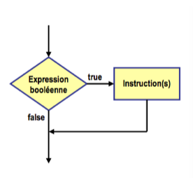
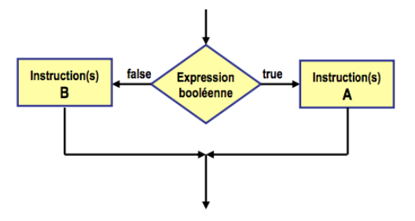

# Instruction IF

Rappel:

 * Opérateurs logiques `not and or`
 * Opérateurs relationnels `== != > < <= >=`

Une condition est évaluée lors de l'exécution du code et en fonction de son résultat (vrai ou faux) le programme exécutera le bloc d'instruction approprié.

## if

Syntaxe:

```py
if expression booléenne:
    instruction;
```



Exemple:

```py
nombre: int = 10

if nombre >= 0:
    print("le nombre", nombre, "est positif")

print("Cette ligne est toujours exécutée")
```

En python, il n'y a pas de parenthèses au if ni d'accolades, l'indention est importante. Notez la ligne vide à la fin du if avant le dernier print, ça permet de bien voir la fin du if.

## if-else

Syntaxe:

```py
if expression booléenne:
    instruction A
else:
    instruction B
```



Exemple:

```py
a: int = 2
b: int = 5

if a < b:
    print("a < b")
else:
    print("a >= b")

print("Fin")
```

## Opérateur ternaire

Lorsque les instructions du if consistent à donner une valeur à une variable:

Syntaxe:

```py
variable = condition if valeur_si_true else valeur_si_false
```

```py
a: int = 2
b: int = 5
min: int

if a < b:
    min = a
else:
    min = b

min = a if a < b else b
```

Le if-else et la dernière ligne de l'exemple précédent sont équivalents.

## if - else if

Syntaxe:

```py
if condition1:
    #instruction si condition1 est vrai

elif condition2:
    #instruction si condition1 est fausse et condition2 est vrai

elif condition3:
    #instruction si condition1 et condition2 sont fausses et condition3 est vrai

else:
    #instruction si condition1 et condition2 et condition3 sont fausses.
```

Exemple:

 * A: 90 - 100
 * B: 80 - 89
 * C: 70 - 79
 * D: 60 - 69
 * E: 0 - 59

```py
note: int = 72
grade: str

if note >= 90:
    grade = 'A'

elif note >= 80:
    grade = 'B'

elif note >= 70:
    grade = 'C'

elif note >= 60:
    grade = 'D'

else:
    grade = 'E'

print(note, ':', grade)
```

## Pléonasmes

Évitez les pléonasmes de programmeurs:

```py
a: int = 2
b: int = 3

# if problématique
if a < b == True:
    print("a < b")

# if corrigé
if a < b:
    print("a < b")
```

```py
# if problématique
if a < b:
    print("a < b")

if a >= b:
    print("a >= b")

# if corrigé
if a < b:
    print("a < b")
else:
    print("a >= b")
```

```py
AGE_MAJEUR: int = 18
age: int
majeur: bool

# if problématique
if age >= AGE_MAJEUR:
    majeur = True
else:
    majeur = False

# if non nécessaire
majeur = age >= AGE_MAJEUR
```

## Redondance

Cas exemple:

Calculer le salaire net à partir du salaire brut.
SI le salaire brut est supérieur ou égal à 1000$ appliquer des déductions de 30% sur le salaire brut.
SI le salaire brut est inférieur à 1000$ appliquer des déductions de 40% sur le salaire brut.

Exemple problématique:

```py
SAL_LIMITE: int = 1000
PCT_INF: float = 0.3
PCT_SUP: float = 0.4

salaireBrut: float
deductions: float
salaireNet: float

print("Salaire brut: ")
salaireBrut = 650 # sera saisi par l'utilisateur plus tard

if salaireBrut >= SAL_LIMITE:
	deductions = salaireBrut * PCT_SUP
	salaireNet = salaireBrut - deductions

else:
	deductions = salaireBrut * PCT_INF
	salaireNet = salaireBrut - deductions

print("Salaire net:", salaireNet)
```

if corrigé:

```py
if salaireBrut >= SAL_LIMITE:
	deductions = salaireBrut * PCT_SUP
else:
	deductions = salaireBrut * PCT_INF

# Ligne sortie du if
salaireNet = salaireBrut - deductions
```

## Simplification

Dans certains cas inverser une condition simplifie le code:

```py
import random

# Version longue
dmg: int
de: int

de = random.randint(1, 6)

if de == 1 or de == 2 or de == 4 or de == 6:
    dmg = de
else:
    dmg = 0

# Version simplifiée 1
dmg: int
de: int

de = random.randint(1, 6)

if de == 3 or de == 5:
    dmg = 0
else:
    dmg = de

# Version simplifiée 2
dmg: int = 0
de: int

de = random.randint(1, 6)

if not (de == 3 or de == 5):
    dmg = de

# Version simplifiée 3
dmg: int = 0
de: int

de = random.randint(1, 6)

if de != 3 and de != 5:
    dmg = de
```

## Truthy et Falsy

Nous avons les valeurs `True` et `False`. Mais tous les autres valeurs en Python peuvent être considérés pour *truthy* ou *falsy* (aucune traduction trouvé pour ces 2 mots).

Les valeurs suivantes sont *falsy*:

 * int: `0`
 * float: `0.0`
 * bool: `False`
 * str: `""` ou `''`
 * tuple: ()
 * liste: []
 * objet: {}

Bref, toutes les valeurs vides ou nulles sont *falsy*. Toutes les autres valeurs sont *truthy*.

Le `if` et `elif` fonctionnent avec les valeurs *falsy* et *truthy*, exemple:

```py
nb = random.randint(0, 1)

# Au lieu de:
if nb == 1:
    print("YEAH!")
else:
    print("nope")

# On fera:
if nb:
    print("YEAH!")
else:
    print("nope")
```