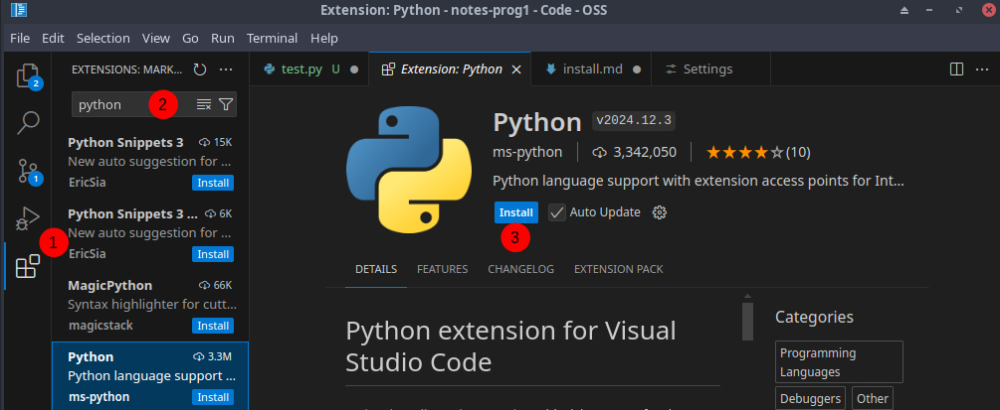

# Installation

Tutoriel pour configurer Python à la maison, au cégep tout devrait être OK.

## Python

Vous devez installer l'interpréteur CPython qui permet d'interpréter votre code Python disponible à l'adresse: https://www.python.org/downloads/

## IDE

Vous avez deux choix, en classe nous utilisons VSCode, une solution gratuite et open source. Vous pouvez aussi utiliser PyCharm, la compagnie charge cher pour ces IDE, mais PyCharm possède une version community qui est gratuite.

### VSCode

Installez l'IDE: https://code.visualstudio.com/

Il faut installer l'extension Python (voir image un peu plus bas avec les étapes).

 1. Ouvrir l'écran d'extensions de VSCode
 2. Cherchez Python, sélectionnez l'extension Python (en bleu dans l'image, sous le numéro 2)
 3. Installez l'extension, attendez que ça affiche "Installed"



Pour vous aider, installez aussi l'extension `Pyright` qui permet la vérification de typage.

### PyCharm

Installez l'IDE (choisir la version community): https://www.jetbrains.com/pycharm/download/

Si vous voulez la version professionnelle, vous avez accès gratuitement durant vos études. Pour la licence, suivez ce guide: https://github.com/Singcaster-CRLJ/CLJ/blob/main/Documents/Jetbrains.md#licence

### Tester votre installation

Pour tester, ouvrez votre dossier de travail avec `File/Open folder`, créez un fichier `test.py` et insérez le code suivant:

```py
print("Bonjour monde")
```

Vous devriez voir en haut à droite de l'application un triangle qui pointe à droite, cliquez dessus et dans la console vous devriez voir `Bonjour Monde`.

Si vous ne voyez pas le triangle, allez dans le menu `Run/Run without debugging` et choisir `Python debbuger` dans le menu qui ouvre en haut de l'écran.

Vous pouvez aussi ouvrir une ligne de commande avec le menu `Terminal/New Terminal` et dans le terminal inscrivez `py test.py`. `py` est une commande qui exécute le fichier python qui suit.