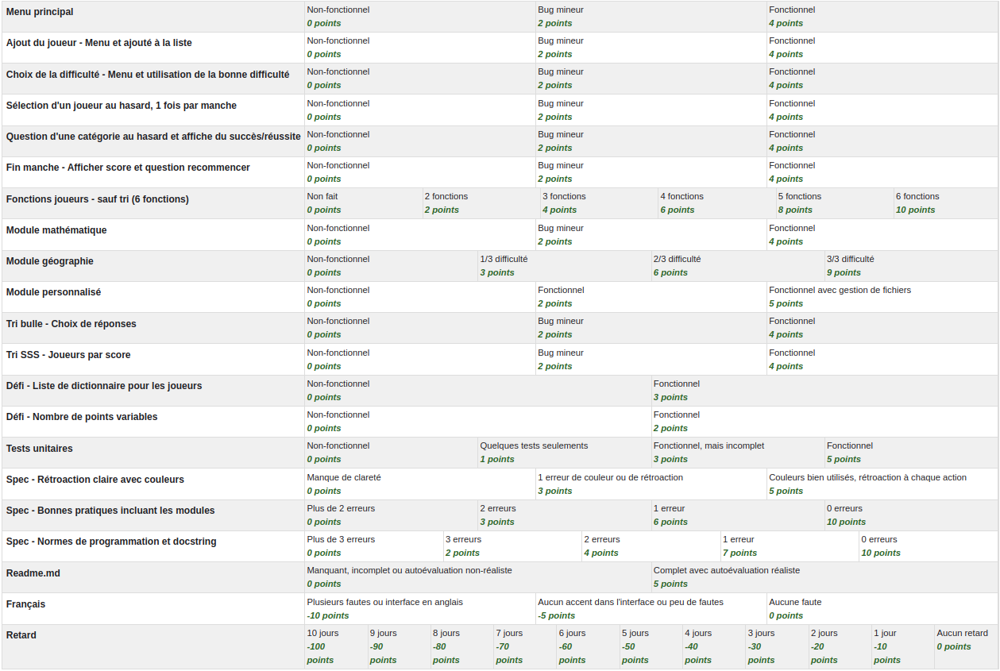

# TP3

Travail individuel, à remettre avant 8h00 le jeudi 18 décembre.

Une démo est disponible [en mp4](../imgs/tps/tp3.mp4).

<video src="../imgs/tps/tp3.mp4"></video>

## Objectif

Vous devez faire un jeu questionnaire. Il y a 3 catégories:

 1. Mathématique, l'utilisateur répond à des questions d'addition ou de multiplication.
 2. Géographie, utilisez la librairie fournie pour poser des questions à choix multiples sur les pays du monde
 3. Catégorie au choix, créez vos propres questions sur un sujet de votre choix. Les sujets doivent respecter les règles du cégep (daucune contenu violent, à caractère sexuel, raciste, sexiste, etc.)

## Fonctionnalités

### Menu principal

Affichez:

 1. La liste des joueurs ou "Aucun joueur" s'il n'y en a pas
 2. Le menu
    1. Ajouter joueur
    2. Débuter la partie (accessible uniquement s'il y a au moins un joueur)
    3. Quitter, quitte le jeu

### Ajout du joueur

Permet d'ajouter un joueur. Si l'utilisateur n'entre rien, on annule et on retourne à l'écran précédent.

Le nom du joueur doit avoir au moins 3 caractères et doit être unique.

### Choix de la difficulté

Proposez trois niveaux de difficulté : Facile, Moyen, et Difficile. Chaque difficulté change la difficulté ou le type de question:

 * Mathématique : Questions plus complexes avec des plages de nombres variées selon la difficulté.
 * Géographie : Questions portant sur le continent, la langue ou la capitale, selon le niveau.
 * Personnalisé : Une liste différente pour chaque niveau avec au moins 4 questions par difficulté.

### Partie

Chaque partie est séparé en manches, à chaque manche on pose une question à un joueur au hasard. Tous les joueurs doivent se faire poser une question à chaque manche. Vous devez choisir une catégorie au hasard, par manche ou par question.

Chaque question bien répondu donne un certain nombre de points. Je vous laisse déterminer le nombre de point de chaque type de question. Faites varier le nombre de points selon la difficulté donné par le random pour math et geographie, par exemple deviner "1 x 1" devrait donner moins de points que "77 x 92", même si c'est le même random. N'hésitez pas à laisser un commentaire pour expliquer votre logique.

À la fin de la manche on affiche les joueurs en ordre de score, le plus élevé en premier. Puis on offre le choix de jouer une autre manche ou de quitter le jeu.

## Spécifications

Votre projet doit être séparé en plusieurs modules, ils doivent tous être dans un sous-dossier sauf votre principal.

Attention, vous ne devez pas faire de boucle d'importation. Par exemple, si votre module main importe le module constantes et que constantes importe main, vous avez une boucle et c'est une erreur!

### Module constantes

Module optionnel.

Définie toutes les constantes et types pouvant être utilisés par plusieurs modules. Par exemple les couleurs du terminal peuvent y être.

### Module utilitaires

Module optionnel.

Définie plusieurs fonctions pouvant être utilisés par plusieurs autres modules.

Vous pouvez copier cette fonction qui permet de vider l'écran du terminal:

```py
def cls() -> None:
    os.system('cls' if os.name == 'nt' else 'clear')
```

### Module principal

Module obligatoire.

Démarre votre jeu, gère tous les menus et les manches.

### Module joueurs

Module obligatoire.

Gère la liste des joueurs.

Un joueur est un dictionnaire contenant le nom et le score du joueur. La liste des joueurs est donc une liste de dictionnaire. La liste des joueurs est privé à ce module (le nom de la variable doit donc débuter par un `_`) et exceptionnellement, elle peut être déclaré avant les fonctions et utilisés directement par les fonctions de ce module sans la passer par paramètres.

N'oubliez pas, tout ce qui débute par un `_` ne doit pas être utilisé en dehors du module.

Vous devez avoir les fonctions suivantes dans votre module (vous pouvez en faire plus selon vos besoins):

 * `nombreJoueurs` qui retourne le nombre de joueurs dans la liste
 * `joueurExiste` qui prend un nom en paramètre et retourne vrai si le joueur existe, faux sinon
 * `ajouterJoueur` qui prend un nom en paramètre et qui ajoute ce nouveau joueur dans la liste
 * `obtenirJoueur` qui prend un nom en paramètre et qui retourne le dictionnaire du joueur. Retourne un dictionnaire valide mais vide si le joueur n'existe pas (le nom est une chaine vide et le score de zéro dans ce cas). Utilisez l'algorithme de fouille vu en classe.
 * `ajouterPoints` qui prend un nom et un nombre de point en paramètres, ajoute le nombre de point donné au bon joueur
 * `nomsJoueurs` qui retourne la liste des noms des joueurs
 * `triJoueurs` qui tri la liste de joueur en ordre de score, le plus élevé en premier, utilisez le tri SSS
 * `afficherListe` qui affiche le nom et le score de chaque joueur

Toutes les fonctions précédentes doivent être testés unitairement et utilisés au moins une fois.

Gérer une liste de dictionnaire est considéré comme un défi valant peu de points. Vous pouvez gérer les joueurs d'une autre manière (pour une petite pénalité). Par exemple un simple dictionnaire (le nom sera la clé et les points seront la valeur), une liste de tuple, deux listes (une pour les noms et une pour les points). Par contre la majorité des autres solutions vont complexifier (voir rendre impossible) votre tri SSS. Si vous avez de la difficulté, je vous conseil de prendre une solution plus simple que la liste des dictionnaires et essayer de l'implémenter à la fin.

### Module mathématique

Module obligatoire.

Ce module doit avoir une seule fonction publique (sans le `_`) qui prend en paramètre la difficulté et qui retourne un tuple (question et bonne réponse).

Vous devez choisir un opérateur au hasard (addition ou multiplication). Vous devez aussi choisir deux nombres au hasard. Voici le tableau des nombres:

| Difficulté |    Addition     | Multiplication |
|:----------:|:---------------:|:--------------:|
|   Facile   |  Entre 1 et 50  | Entre 1 et 10  |
|   Moyen    | Entre 1 et 500  | Entre 1 et 25  |
| Difficile  | Entre 1 et 2000 | Entre 1 et 100 |

Vous pouvez changer les opérateurs (tant qu'il y en a au moins 2) et les nombres (tant qu'il y a une différence entre les opérateurs et une progression selon la difficulté).

### Module géographie

Dans votre projet, ajoutez un dossier `fichiers` et copiez-y le fichier [`continents_pays.json`](tp3_fichiers/continents_pays.json).
Dans votre dossier `lib`, copiez-y le fichier [`pays.py`](tp3_fichiers/pays.py). Ce module vous permet d'obtenir des informations sur les pays du monde. Ces deux fichiers ont été créés par moi avec l'aide d'un AI.

Notez que le code de `pays.py` ne respecte pas toujours les bonnes pratiques afin de ne pas donner de solution. Les deux fichiers ne doivent pas être modifiés et vous ne pouvez pas utiliser les fonctions et variables privés.

Dans cette catégorie, vous devez afficher des choix de réponses. Les choix de réponses doivent être triés en ordre alphabétique en utilisant un tri bulle.

Difficulté facile: Affichez en choix de réponse tous les continents. Choisissez un pays au hasard. L'utilisateur doit deviner dans quel continent se trouve le pays donné.
Vous aurez besoin des fonctions `listeContinents` et `listePaysComplete`.

```
# Exemple de quesiton facile:
Question géographie!
Parmis les continents: Afrique, Amérique, Asie, Europe, Océanie
Ou se trouve le pays Mauritanie?
```

Difficulté moyenne: Choisissez un pays au hasard, sélectionnez une langue au hasard parmis les langues parlés de ce pays. Ajoutez dans une liste ou tableau 3 autres langues au hasard. L'utilisateur devra choisir la langue parlé dans le pays sélectionné.
Vous aurez besoin des fonctions `listeLanguesOfficielles` et `obtenirLanguesOfficielles`.

Attention de ne pas sélectionner une autre langue parlé dans ce pays. Par exemple vous sélectionnez le Canada et le français, vous ne pouvez pas sélectionner l'anglais ni le français comme mauvais choix de réponse.

```
# Exemple de question moyenne:
Question géographie!
Parmis les languages: Aymara, Laotien, Tigrigna, Zoulou
Laquelle est parlé dans le pays Laos?
```

Difficulté difficile: Sélectionnez encore un pays au hasard, allez chercher sa capitale que l'utilisateur devra trouver. Prennez 3 autres pays au hasard (mais différent des autres) avec leur capitale pour former les choix de réponses. Attention, ma fonction peut donner `N/D` comme capitale, ce choix n'est pas valide vous devrez prendre un autre pays au hasard.
Je vous laisse regarder le code du module pour trouver la fonction à utiliser.

```
# Exemple de question difficile:
Question géographie!
Parmis les villes suivantes: Accra, Manila, Port Vila, Tirana
Laquelle est la capitale du Ghana? 
```

### Module personnalisé

Les questions doivent être enregistrés dans 3 fichiers textes, un fichier par difficulté, une question et réponse par ligne, ajoutez un séparateur spécial (par exemple `###`) pour séparer la question de la réponse. Chaque niveau de difficulté doit contenir au moins 4 questions. Chaque fichier semblera à ceci:

```
Quel est le nom de la princesse dans le jeu vidéo "The Legend of Zelda"?###Zelda
Quel est le nom de famille de Mario, le plombier célèbre de Nintendo?###Mario
Quel est le mot préféré de Pikachu dans la série animée Pokémon?###Pikachu
```

Lorsque vous chargerez le fichier texte correspondant à la difficulté, utilisez une **expression régulière** pour séparer le fichier dans une liste (question et réponse dans des cases séparés, vous aurez donc 2x plus de cases que de question). L'exemple précédent donnera:

```py
[
 "Quel est le nom de la princesse dans le jeu vidéo \"The Legend of Zelda\"?",
 "Zelda",
 "Quel est le nom de famille de Mario, le plombier célèbre de Nintendo?",
 "Mario",
 "Quel est le mot préféré de Pikachu dans la série animée Pokémon?",
 "Pikachu"
]
```

## Spécifications

 * Toute entrée non valide par l'utilisateur dans les menus (donc partout sauf dans les questions du jeu) doit afficher un message d'erreur clair. Le jeu ne doit pas planter peut importe la niaiserie écrite par l'utilisateur
 * Utilisez des couleurs pour mettre de l'emphase aux bons endroits (voir démo pour des exemples)
 * Vous ne pouvez pas utiliser les commandes non-vues en classe (break, continue, pass, random.choice, exit, etc.). Toute commande interdite sera supprimé avant la correction.
 * Utilisez les bonnes pratiques vues en classe (un seul return par fonction, bonne structure de donnée selon le besoin, pas de variable inutile dans les while, pas de boucle d'appel de fonction, git propre, etc.)
 * Respectez les normes de programmations (indentation, nommage, casse des identificateurs, pas de pléonasmes, etc.)
 * Vous devez faire la docstring de toutes les fonctions du module principale, ainsi que dans toutes les fonctions publiques des autres modules

## Autoévaluation

À la racine de votre Github, ajoutez un fichier `readme.md`, dans ce fichier inscrivez:

 * Votre nom
 * Le nombre d'heures (approximativement) que vous avez pris pour faire le projet
 * En image, tableau ou liste à puce, votre autoévaluation (reprendre la grille et dites combien de points vous vous donnez pour chaque ligne)

## Remise

Avant 8h00 le jeudi 18 décembre sur Github: https://classroom.github.com/a/FNZUlHtD. La grille de correction est sur Moodle et votre correction s'y trouvera.

En cas de retard, avertissez moi avant la remise et lorsque vous l'avez remis. En cas de non-respect de ces consignes, vous pourriez avoir un délais pour avoir votre note qui pourrait aller jusqu'en janvier.

## Grille de correction

Capture d'écran de Moodle.

